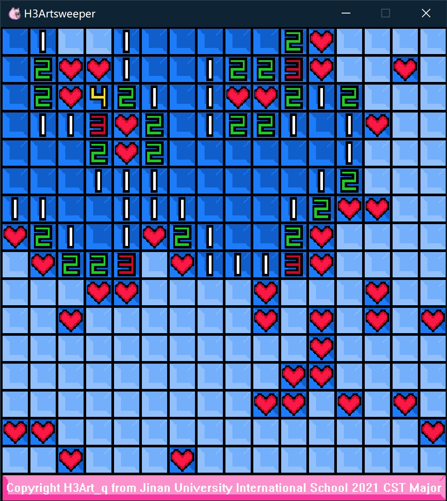
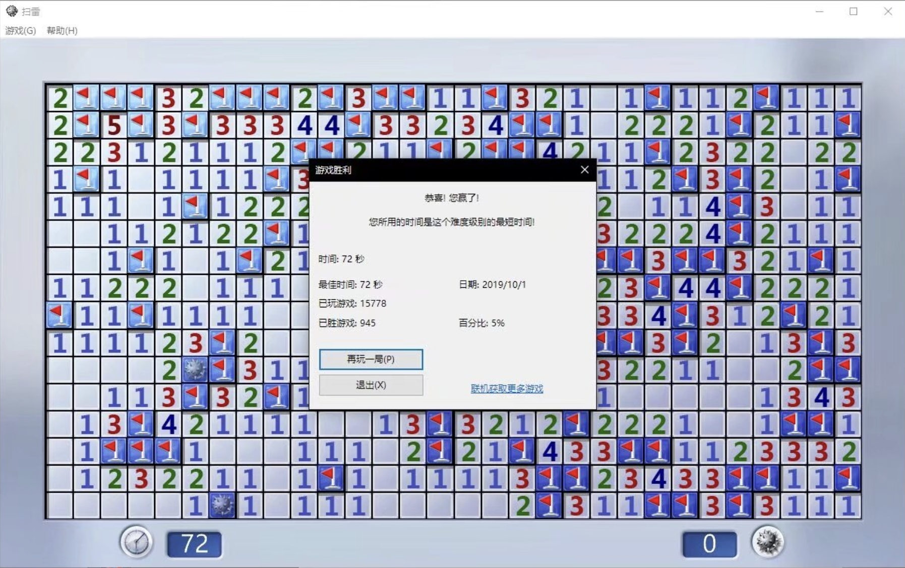

# H3Artsweeper/哈特扫雷/~~扫哈特~~

> 一个值得纪念的开始😋
> 

> H3Art
>  
> 2022.04.13
>  
> 

## 介绍
这是本人接触编程后完成的第一个项目，出于兴趣，根据视频[C/C++游戏项目教程：《扫雷》](https://www.bilibili.com/video/BV1oF411a7MQ/?share_source=copy_web&vd_source=2e2bcfa887bf8da9bde84af9fe79f8eb)学习并逐步构建

   
  实机演示（误）  

JNU-IS-CST培养方案中的的编程入门课程**Problem Solving and Programming 问题求解与程序设计**并没有关于构建个人项目的要求，所有的编程内容都为以C语言为主的小代码量作业。私以为这个**作业量不足**以将C语言的熟练度提高至应对接下来课程的水平，因此自己增加一点编程练习是有必要的

H3Artsweeper中的贴图是使用[LZ 8bit像素画在线制作器](http://www.lizibuluo.com/8bit/)绘制的，游戏只实现了基本的扫雷功能：
- 基本的标记、点击、连续开格以及游戏的胜利与失败判定
- 计时器只能在游戏成功后看到计时结果
- 难度调整只能靠自己重新编译构建不同版本的H3Artsweeper来实现

## 获取H3Artsweeper

### 直接获取
点击该链接或Github仓库页面右侧的Release获取，注意：
- 可执行文件.exe与贴图文件需放置在同一文件路径下，否则游戏开始后为黑屏
- 启动时可能弹出黑框，为正常现象

### 编程语言、开发环境及必要库
- C/C++（基本只用上了C的语法）
- Windows
- Microsoft Visual Studio
- [EasyX](https://easyx.cn/)（针对 Visual C++ 的免费绘图库）

## 个人记录纪念

   
  与这游戏结缘还得追溯到高中机房只有我的电脑没法打CS【

